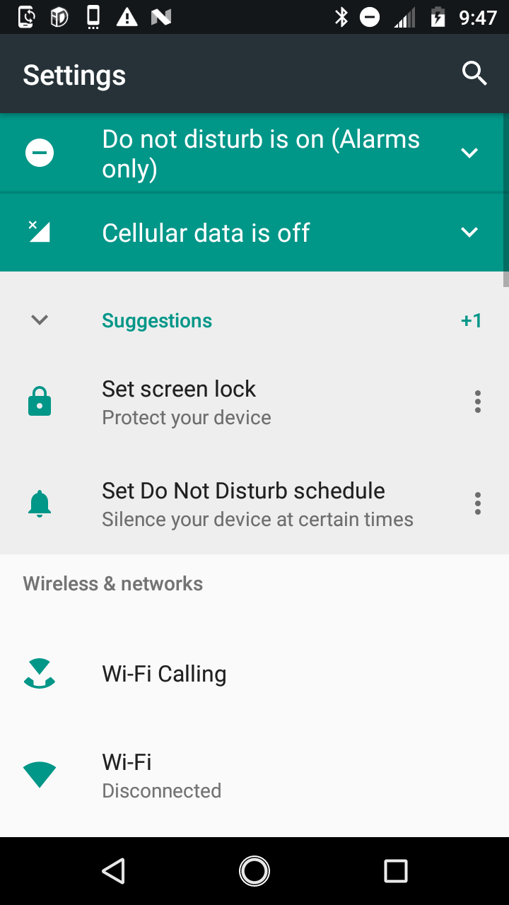
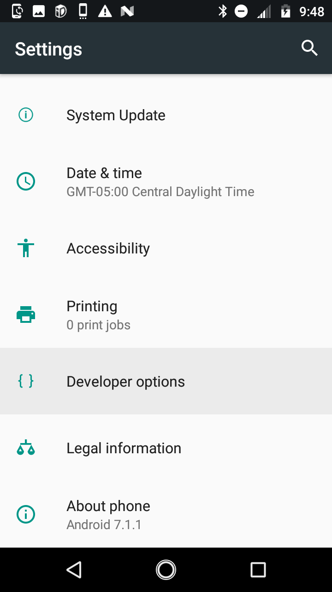
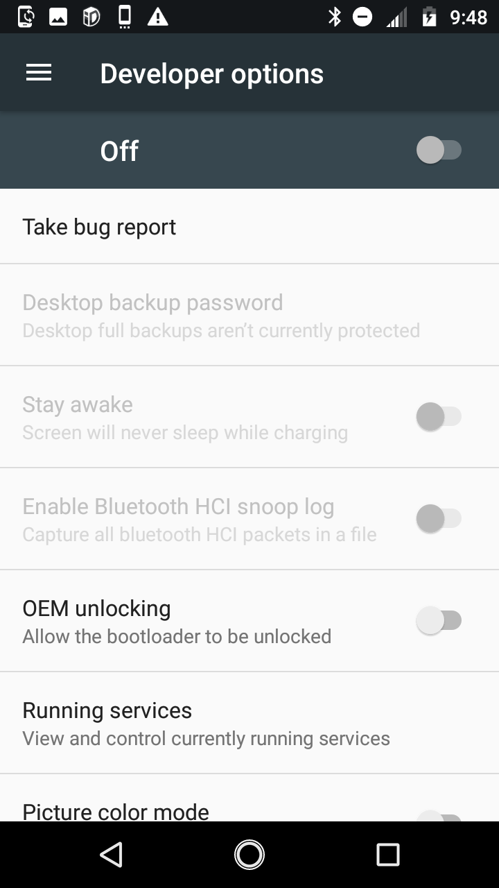
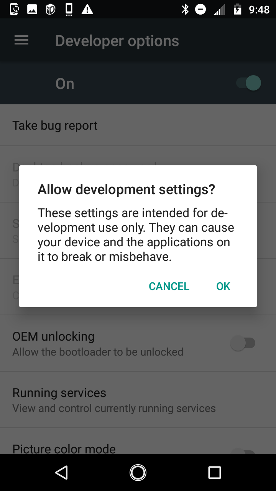
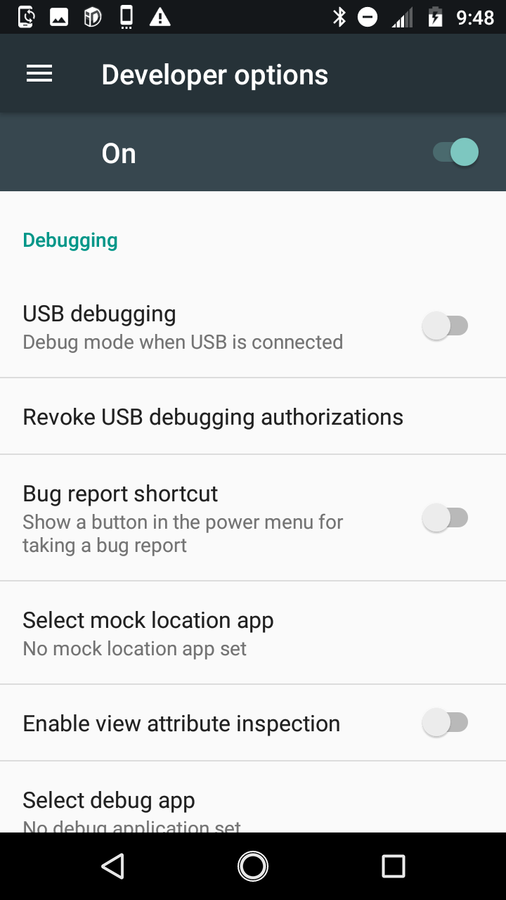
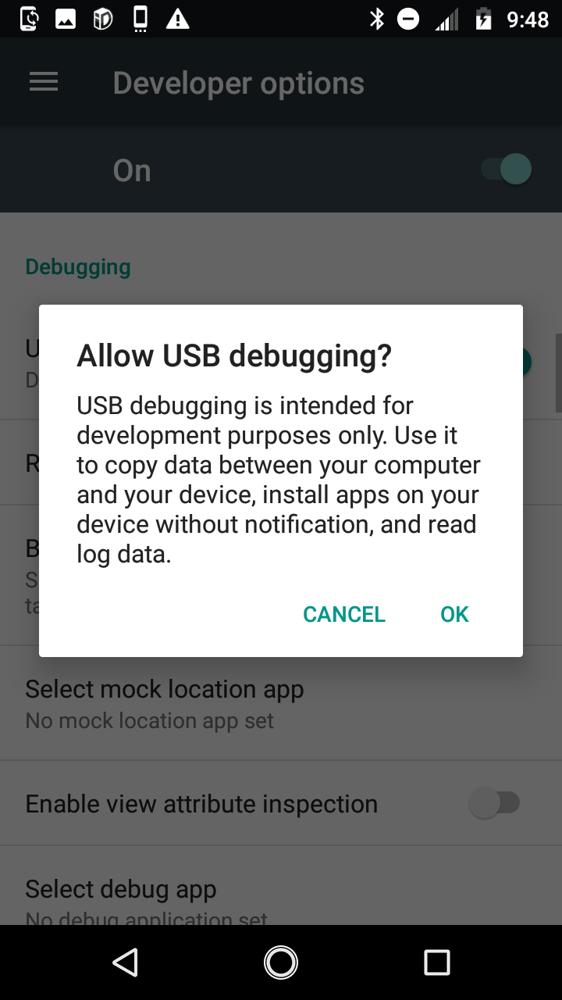

# Connecting an Android Device

### **Android Developer Options**

In order to use the REV Hardware Client the phone's developer settings and USB debugging options need to be turned on. 

The developer options on Android Devices are hidden within the phone as a default. Different phone manufactures have different ways of accessing the developer options. However, once the developer options are available in the phone's settings, the steps for activating USB debugging and development settings are similar. 


Before moving forward it is advised to look up where the developer options on your Android Device are located. For Motorola users, the [Motorola Support Page](https://support.motorola.com/us/en/solution/ms95240) has information on how to unlock the developer options.


|  |  |
| :--- | :--- |
| Open the Android Devices settings |   |
| Scroll to the bottom of the settings, where the unlocked developer options are available. Open the developer options |    |
| At the top of the developer options page is an on/off switch. Turn the developer options on. |    |
| The device will open a confirmation message. Select 'OK.' |    |
| Scroll through the developer options until you find the Debugging section. Turn USB Debugging on. |    |
| Another confirmation message will appear, click 'OK.' |    |

USB debugging is now on! You can move on to the steps for installing the application.

Depending on the device you may need to change the USB Settings from "Charging only" to "File Transfer".

Plug the Android Device with USB Debugging into the Windows PC running the REV Hardware Client.

