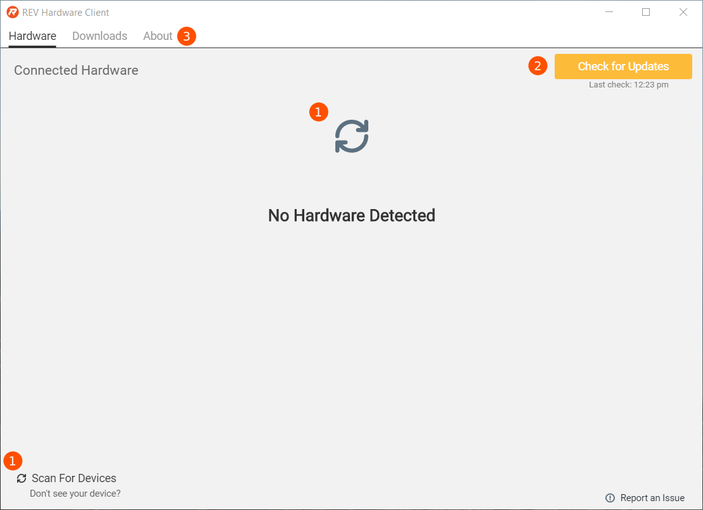
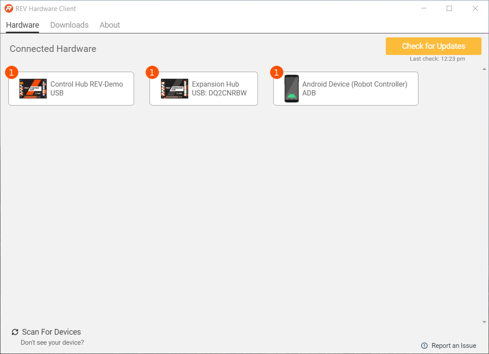
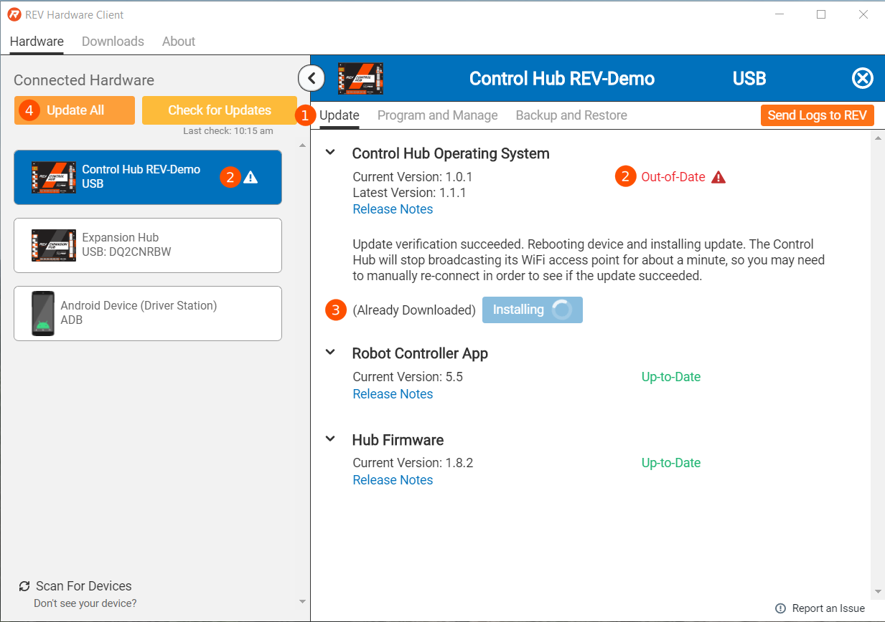

# Navigating the Client

The REV Hardware Client has three tabs to manage different features of the Client. The Hardware Tab is where supported hardware devices are managed. The Downloads Tab allows for the downloading of supported device software for updating when offline. The About Tab has information on what devices are supported, updating the REV Hardware Client, and having issue reporting.

## Hardware Tab

When first booting the REV Hardware Client the Hardware Tab is displayed.

### No Hardware Detected

1. **Scan for Devices** - When supported REV hardware is connected to a Windows PC the Client will auto scan for new devices. You can Scan for Devices if the device did not automatically populate.
2. **Check for Updates** - This checks for any updates available for the REV Hardware Client
3. **Navigation** - Three tabs are at the top of REV Hardware Client allowing 

### Hardware Detected

Connecting supported hardware to a Windows PC with the REV Hardware Client running will automatically scan and add the devices to the Hardware Tab.

1. **Supported Hardware** - Each type of supported hardware will appear. Clicking on the Hardware will bring up each units Device Menu

### Device Menu

Selecting a Device will bring up that device's menu. Below is a screenshot of the Control Hub's Device Menu.

1. **Device Menu Tabs** - Different devices will have various supported tabs. All devices have an Updates Tab handling software updates for for device. The Control Hub has a Program and Manage Tab giving access to the Robot Control Console. The Control Hub also has a [Backup and Restore Tab](../control-hub/restoring-user-data.md) allowing for the back up and restoration of configuration files as well as blocks and java code.
2. **Out of Date Warning** - There are two indicators that a part of the software on the device is out of date.
3. **Download and Install** - Under each update type are buttons to download and install that update.
4. **Update All** - This button will update all software items for all connected devices. This type of update can take a while depending on the number of devices connected and the type of update.

