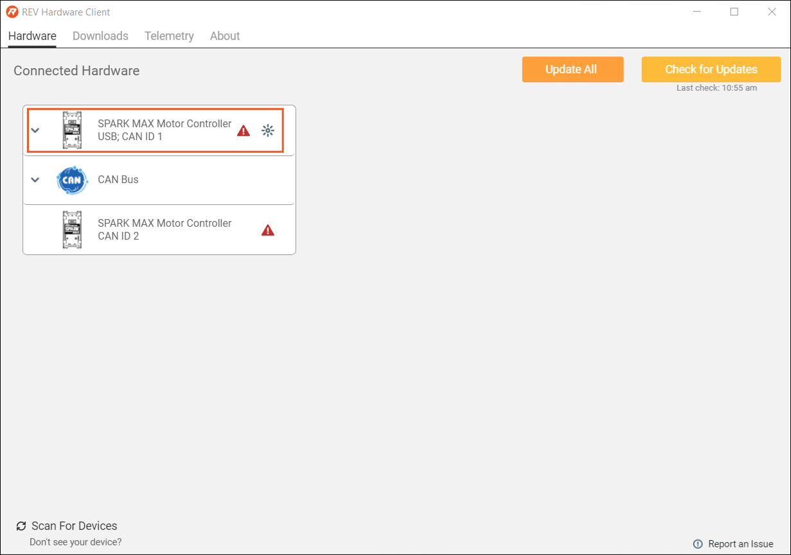
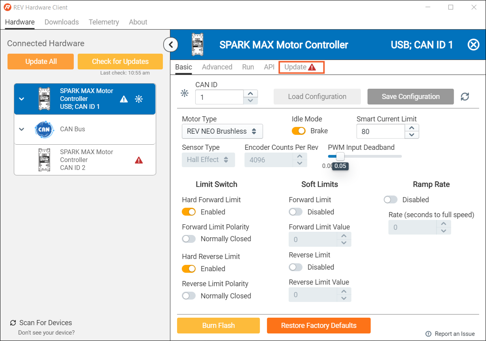
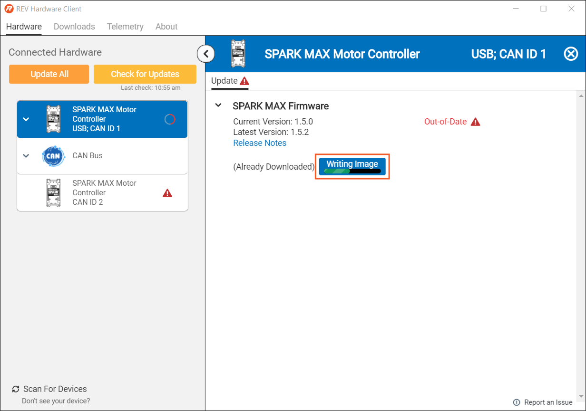
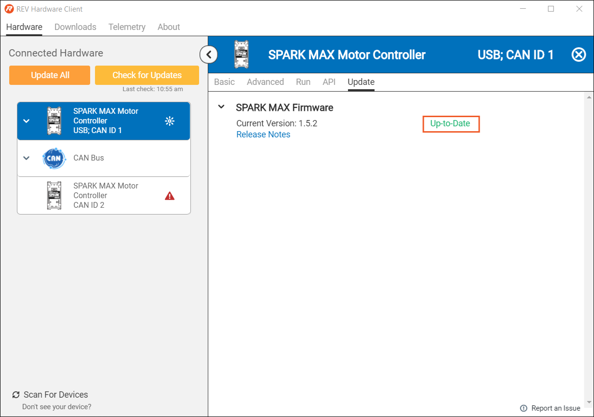

# Updating SPARK MAX Software

The SPARK MAX has two main software components, the firmware and the API to control SPARK MAX via CAN. Installing the latest version of each is possible with the REV Hardware Client.

## Updating Firmware

Once the SPARK MAX is connected via USB-C select it within the **Connected Hardware.** 

Within the Hardware Client, for the SPARK MAX, there are 5 tabs. The Hardware Client will open up on the **Basic** tab. To update firmware select the **Update** tab. 

Under **SPARK MAX Firmware**, select download to download the latest version of the firmware. 

Once the firmware has downloaded select update.

The update process will flash the firmware image onto the SPARK MAX. The status bar will show the progress of the process. 

Once the firmware update is done your SPARK MAX will show a new status of **Up-to-Date.**

## Installing API Libraries 

In order to install C++ of Java APIs you must first install the most recent version of WPILib. Click the link for **WPILib Offline Install Instructions** and follow the steps to install WPILib. 

